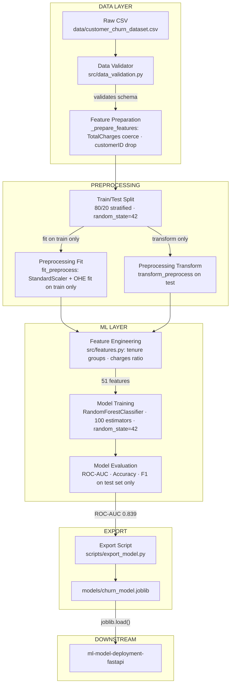
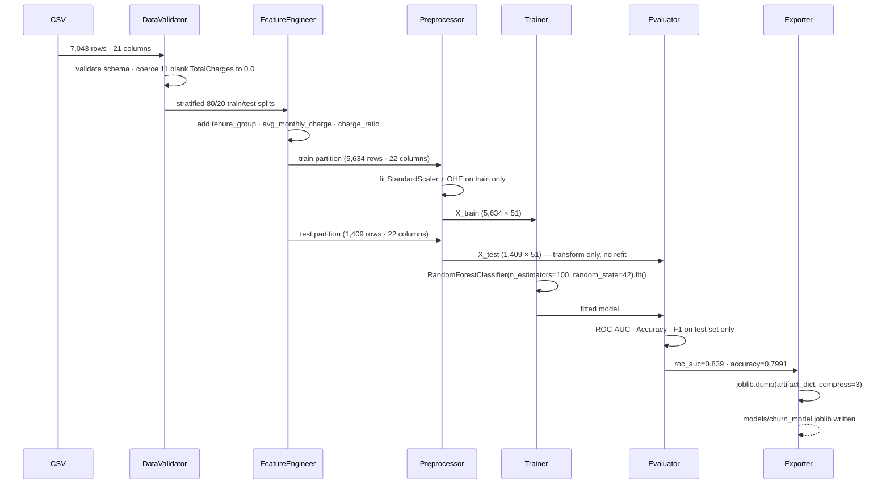

# Customer Churn Prediction ML Pipeline

[](https://github.com/SourabhaKK/customer-churn-prediction-ml/actions/workflows/ci.yml)

End-to-end scikit-learn ML pipeline for customer churn prediction — leakage-safe preprocessing, TDD methodology, and joblib model export for downstream serving.

---

## Architecture



---

## Data Flow



---

## Key Metrics

| Metric | Value |
|--------|-------|
| Dataset | 7,043 rows · 19 raw features |
| Train / Test split | 5,634 / 1,409 (stratified 80/20) |
| Post-encoding features | 51 |
| Model | RandomForestClassifier (100 estimators) |
| ROC-AUC | 0.839 |
| Accuracy | 79.91% |
| Churn-class F1 | +0.58 vs majority baseline |
| Test suite | 92 tests · 100% pass rate |
| Inference latency | 16.8 ms (single-row) |

---

## Engineering Highlights

- **Leakage-safe preprocessing**: `StandardScaler` and `OneHotEncoder` are fit exclusively on the training partition via `fit_preprocess`, then applied to test data via `transform_preprocess`. A dedicated leakage test class enforces no refitting on test data.
- **TotalCharges blank-string handling**: 11 rows in the raw Telco CSV store `TotalCharges` as blank strings. The pipeline coerces them via `pd.to_numeric(errors='coerce').fillna(0)` with a `WARNING` log before validation fires.
- **customerID dropped before encoding**: `_prepare_features` drops `customerID` prior to `ColumnTransformer` to prevent 7,043 spurious OHE columns from inflating the feature space.
- **Deterministic evaluation**: `random_state=42` is fixed at every call site — `train_test_split`, `RandomForestClassifier`, and `train_model` — guaranteeing bit-for-bit reproducible metrics across runs.
- **Export artifact contains model + metadata**: `scripts/export_model.py` serialises a dict with `model`, `feature_count`, `model_version`, `roc_auc`, `accuracy`, and `trained_on` timestamp. The serving layer validates `feature_count` on load to catch silent shape mismatches.
- **9 TDD cycles across 6 src modules**: every function was written test-first; RED→GREEN→REFACTOR screenshots are preserved in `outputs/`.

---

## Project Structure

```
customer-churn-prediction-ml/
├── src/
│   ├── data_validation.py          # Schema and data quality checks
│   ├── preprocessing.py            # Leakage-safe fit/transform pipeline
│   ├── features.py                 # Derived feature engineering
│   ├── train.py                    # RandomForestClassifier training
│   ├── evaluate.py                 # Metrics on held-out test set
│   ├── pipeline.py                 # End-to-end orchestration
│   └── predict.py                  # Inference interface
├── scripts/
│   └── export_model.py             # Trains and exports churn_model.joblib
├── tests/                          # 92 pytest cases across 8 modules
│   ├── test_data_validation.py
│   ├── test_preprocessing.py
│   ├── test_features.py
│   ├── test_training.py
│   ├── test_prediction.py
│   ├── test_evaluate.py
│   ├── test_export.py
│   └── test_integration_regression.py
├── models/
│   └── README.md                   # Artifact docs (joblib excluded from git)
├── data/
│   └── customer_churn_dataset.csv
├── .github/workflows/ci.yml
├── requirements.txt
└── README.md
```

---

## Quickstart

```bash
git clone https://github.com/SourabhaKK/customer-churn-prediction-ml
cd customer-churn-prediction-ml
python -m venv venv
venv\Scripts\activate        # Windows
pip install -r requirements.txt
```

Run the full pipeline:

```bash
python -m src.pipeline
```

Export the trained model:

```bash
python scripts/export_model.py
```

Run tests:

```bash
pytest tests/ -v
```

---

## CI/CD

The CI pipeline triggers on every push and pull request to `main`. It runs four steps in order on `ubuntu-latest` with Python 3.11: repository checkout (`actions/checkout@v4`), Python environment setup (`actions/setup-python@v5`), dependency installation (`pip install -r requirements.txt`), and the full test suite (`pytest tests/ -v --tb=short`). The badge above reflects the current status of the `ci.yml` workflow on the `main` branch.

---

## Ecosystem Position

This pipeline is the training layer of a connected ML system:

| Layer | Repo | Role |
|-------|------|------|
| ML Training | customer-churn-prediction-ml | ← YOU ARE HERE |
| LLM Backend | llm-ai-basket-builder | GPT-4o-mini + Pydantic + FastAPI |
| Model Serving | ml-model-deployment-fastapi | Serves churn model · Docker · AWS EC2 |
| Drift Detection | ml-model-monitoring-drift-detection | PSI / KS / Chi-Square · CLI |
| NLP Pipeline | nlp-complaint-classification-pipeline | TF-IDF + BERT · 253 tests |

---

## Engineering Notes

- **Why fit/transform separation instead of `fit_transform` on the full dataset**: calling `fit_transform` on the full dataset before splitting allows test-set statistics (mean, variance, category frequencies) to leak into the scaler and encoder, producing optimistically biased evaluation metrics. `fit_preprocess` + `transform_preprocess` prevents this by ensuring the transformer sees only training data during fitting.

- **Why `TotalCharges` required explicit coercion**: the Telco CSV stores `TotalCharges` as `dtype=object` because 11 rows contain blank strings for customers with zero tenure. Without `pd.to_numeric(errors='coerce').fillna(0)`, the column lands in the categorical pipeline (OHE) instead of the numeric pipeline (StandardScaler), producing incorrect feature types and silent value corruption.

- **Why `customerID` must be dropped before OHE**: `customerID` is a unique string identifier. If it reaches `OneHotEncoder`, it produces one binary column per customer (7,043 columns), inflating memory use, training time, and model complexity without adding predictive signal. `_prepare_features` removes it before any `ColumnTransformer` step.

- **Why `random_state=42` at every split point**: a single fixed seed is not sufficient if `train_test_split`, `RandomForestClassifier`, and `train_model` each use independent sources of randomness. Fixing all three guarantees that re-running the pipeline on the same dataset always produces the same split, the same tree structure, and the same evaluation metrics — making results auditable and reproducible.

- **Why the export artifact stores `feature_count` alongside the model**: the FastAPI serving layer calls `joblib.load()` and immediately checks `artifact["feature_count"] == 51` against the shape of incoming request data. Without this guard, a feature engineering change that adds or removes a column would cause a silent shape mismatch at inference time rather than a loud failure at export time. Storing the count in the artifact makes the contract between training and serving explicit and machine-checkable.
